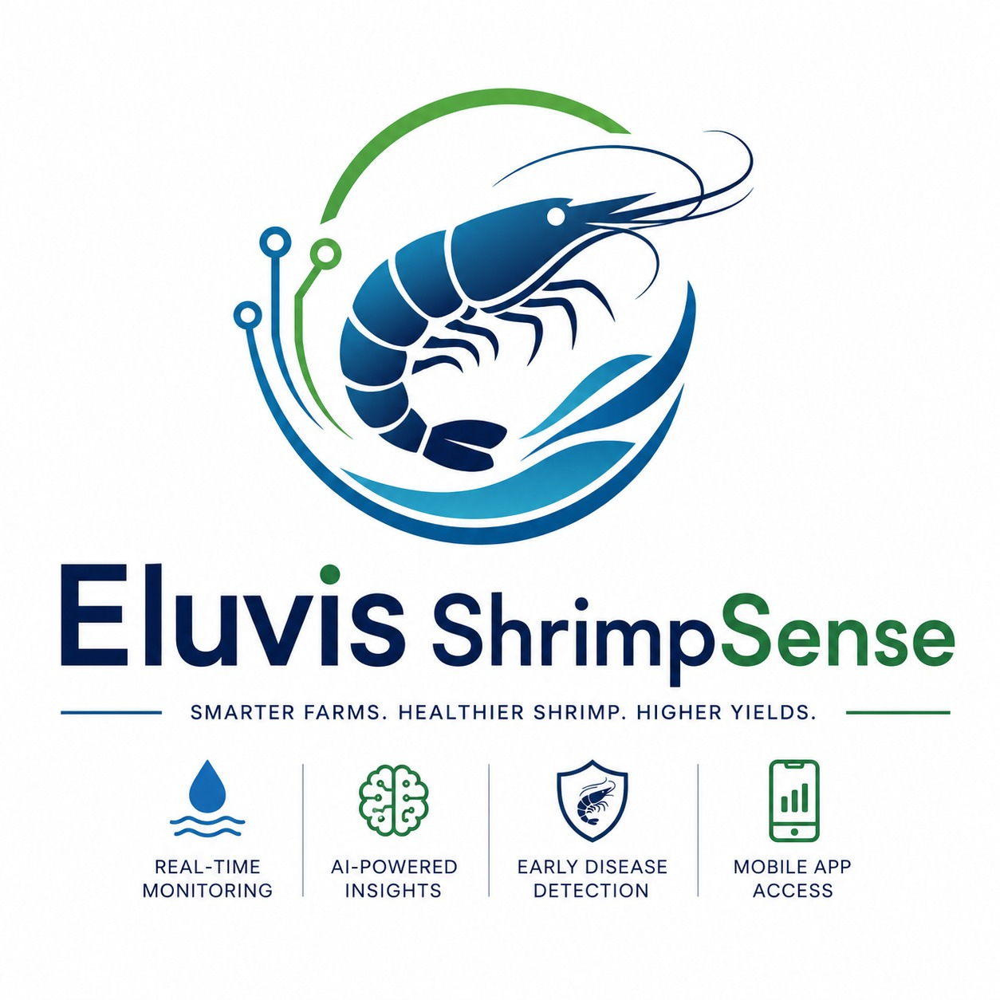
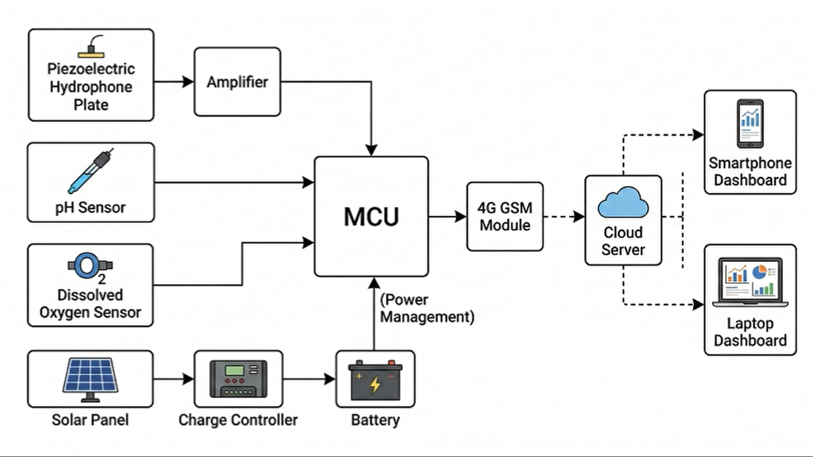

# 🦐 Eluvis ShrimpSense

<p align="center">
  
</p>

<h3 align="center">
Smart AI-Based Shrimp Farm Monitoring System
</h3>

<p align="center">
Real-time aquaculture monitoring using IoT sensors, hydrophone-based shrimp activity analysis, and intelligent data insights.
</p>


---

## 🌊 Overview

**Eluvis ShrimpSense** is an IoT-enabled smart shrimp farming solution designed to improve shrimp farm productivity by continuously monitoring environmental conditions and shrimp behavior.

The system combines:

- 🌡️ Real-time water quality monitoring
- 🎧 Hydrophone-based shrimp activity detection
- 🤖 Machine Learning-based behavior analysis
- 📱 Mobile application for farm management
- ☁️ Cloud-connected IoT platform

The platform helps farmers make data-driven decisions, reduce risks, and optimize shrimp growth conditions.

---

## 🚀 Key Features

### 🌡 Environmental Monitoring

Continuously monitors important pond parameters:

- Water temperature
- pH level
- Dissolved oxygen
- Salinity
- Turbidity
- Other water quality parameters


### 🎧 Shrimp Behavior Monitoring

Using hydrophone sensing technology:

- Captures underwater shrimp activity sounds
- Analyzes feeding and movement patterns
- Detects abnormal behavior conditions


### 🤖 AI & Machine Learning

Machine learning models are used to:

- Analyze shrimp activity patterns
- Identify changes in shrimp behavior
- Generate intelligent farming insights


### 📱 Mobile Application

The mobile app provides:

- Live sensor dashboard
- Farm status monitoring
- Historical data visualization
- Alerts and notifications


### ☁️ IoT Cloud Platform

Features:

- Real-time data synchronization
- Remote monitoring
- Data storage
- Farm analytics


---

## 🏗 System Architecture


<p align="center">
  
</p>

<h3 align="center">
Smart AI-Based Shrimp Farm Monitoring System
</h3>


---

## 🛠 Technologies Used

### Hardware

- ESP32 Microcontroller
- Water quality sensors
- Hydrophone sensor
- Custom sensor interface
- Power management system


### Firmware

- C/C++
- ESP-IDF / Arduino Framework
- MQTT Communication
- Sensor data acquisition
- Device control


### Software

- Flutter Mobile Application
- Firebase / Cloud Database
- REST API
- Data visualization


### Machine Learning

- Python
- Signal processing
- Feature extraction
- Classification models


---

## 📂 Repository Structure


Eluvis-ShrimpSense/
```
│
├── firmware/
│ ├── ESP32 Code
│ ├── Sensor Drivers
│ └── Communication Modules
│
├── mobileApp/
│ ├── Flutter Application
│ └── UI Components
│
├── images/
│
└── README.md

```

---

## 📊 Data Flow


Sensors
|
↓
ESP32 Edge Device
|
↓
Cloud Database
|
↓
Mobile Dashboard
|
↓
AI Analysis & Alerts


---

## 🎯 Objectives

- Improve shrimp farm productivity
- Reduce losses caused by poor water conditions
- Provide early detection of abnormal shrimp behavior
- Reduce manual monitoring effort
- Enable smart aquaculture management


---

## 🌱 Future Improvements

- Automated feeding control
- Disease prediction using AI
- Multi-farm management dashboard
- Advanced shrimp growth prediction
- Commercial deployment


---

## 👥 Team

Developed by:

**Eluvis Technologies**

Smart solutions for sustainable aquaculture.


---

## 📜 License

This project is currently under development.

© 2026 Eluvis Technologies
